# Polling Magic

Polling Magic is a website desgined to gather and display information about the Magic: The Gathering fanbase. The purpose of this site for the user is to be able to like/dislike and discuss current rotating sets as part of the standard game mode in Magic: The Gathering.

## User Stories

- As a site user I can view the current opinions of other users on the latest Magic set posts so that I can select and view one.
- As a user I can register an account so that I can comment and like/dislike set posts.
- As a user I can register a unique account so I can comment and like on each set.
- As a user I can like or dislike a set post so that I can contribute to the opinion of the fan base on the site.
- As a user I can leave comments on a post so that I can be involved in the conversation.

## UX

Polling Magic was created as a space for the Magic community to have a resonable discourse about Magic: The Gathering sets. Its secondary function is to illustrate to the marketing, creative and all other relavant departments at Magic: The Gathering how thier products and services are being received by their target audience. In the future, sourcing consumer satisfication could be made a whole lot easier and streamlined thanks to sites such as this.

### Colour Scheme

The `#ff8800` orange colour was utilised as it is similar to the colour of the orginal Magic: The Gathering logo font. This original logo served as inspiration for the colour scheme. This colour was used in headings, menu bar, footer and in the logo.

A white colour `#ffffff` was used for most of the text on the site, primarily for the `
` sections. It was also used in the footer for social media icons and to highlight the form link.

The black colour `#f0f0f0` was used as a background colour primarily. It is found in the header and footer as a background colour and serves as an excellent contrast for the orange `#ff8800` colour. 

### Typography

The eczar font looks similar to the belern font used in Magic: The Gathering products and logos. Since the belern is a copyrighted font and cannot be used outside of Magic: The Gathering products, eczar was the font selected as most appropriate.

[Eczar](https://fonts.google.com/specimen/Eczar)

Rubik was the other font used throughout the site, in the main body of each section. It's simple and elegant structure was what made it suitable to use as a font, and was important when implementing a simplistic design for the site.

### Lucid Charts

- Main Page Lucid Chart
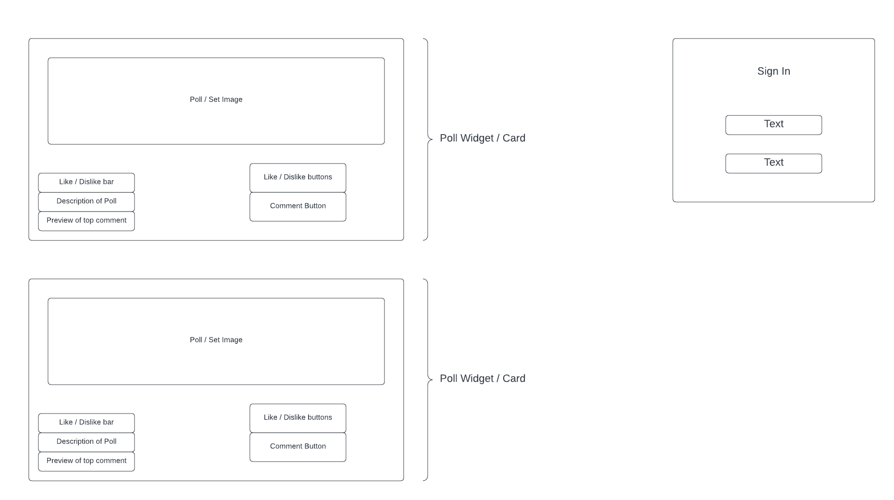

- Poll Page Lucid Chart
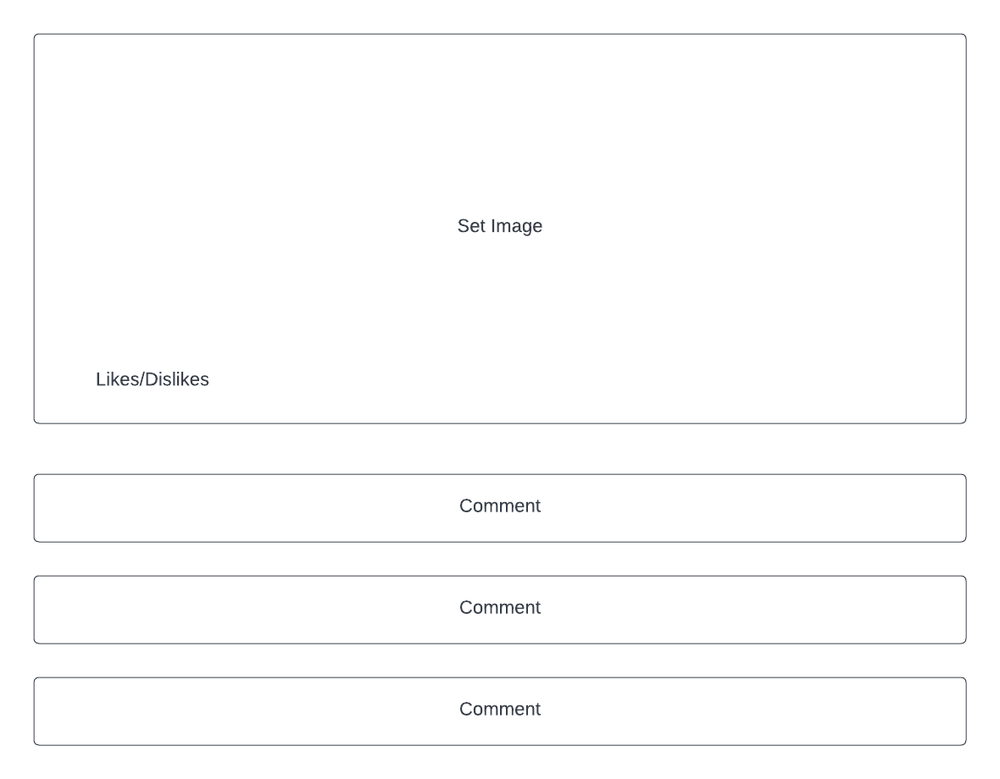

## Features

### Existing Features

- __Polls__

- Polls are the primary feature of this site. Their purpose is to portray to the user the popularity of any given Magic: The Gathering set.
- They are showen in list form to the user, and illustrate the amount of likes, comments, lore and release date of any given set on the site.

- __Likes/Dislikes__

- Likes are showen on each poll to show how popular sets are amoungst the users of the site.
- Dislikes are showen on each poll to show how unpopular sets are amoungst the users of the site.

- __Comments__

- Each poll features its own comments section. Any user may comment on any poll.
- It allows users to say how they felt about a particular set.
- Conversely it allows user to voice their concern or displeasure at a particular set.
- The comments feature allows the Magic: The Gathering community to deliberate on any given set and give Magics parent company (Wizards of the Coast) an opportunity to see how their latest set is going down with consumers. 

- __Navbar__

- Allows the user to navigate the site.
- Features a registration button to allow new users to join the site.
- A login button, so that memebers can sign in.
- A logout button to allow the user to logout from their account. 

### Features left to Implement

- Allow any user to upload a new set poll, not just an administrator. 
- Include more Magic: The Gathering products in polls thast aren't polls such as secret lair drops and Magic video game releases.
- Add more lore friendly liking and disliking buttons. Also to add in total number of views to each post.
- Better visualisation of the new cards in the set, also things like new mechanics should bew noted in each poll.

## Technologies

- Django was used as the web framework for this project. [Django](https://www.djangoproject.com/)
- Python was used as primary programming language for this project. [Python](https://en.wikipedia.org/wiki/Python_(programming_language))
- HyperTextMarkup Langugae (HTML) was another programming language used for this project. It was utilised for the main content of the website and as the standard markup language. It was also used because of its ability to be used alongside Cascading Style sheets programming language. [HTML](https://en.wikipedia.org/wiki/HTML)
- Cascading Style Sheets (CSS) was the programming langugae used in conjunction with HTML. It was used to present the markup langugae HTML. CSS was used to put the HTML into a presentable form. [CSS](https://en.wikipedia.org/wiki/CSS)
- Git was the technology used for version control. It is free and open sourced. [Git](https://git-scm.com/)
- GitHub was used as a code hosting site for storing the code for this project online securely. [GitHub](https://github.com/)
- Gitpod is a cloud based IDE which was used to write the code for this project. [Gitpod](https://www.gitpod.io/)
- Heroku is a cloud based application. It was used for deployment of the application. [Heroku](https://www.heroku.com/home)
- Lucidchart is a web based tool that was used to create a flowchart for this project. [Lucidchart](https://bit.ly/3rgpbku)
- Postgres is a cloud based database management system that uses SQL. [Postgres](https://www.postgresql.org/)

## Testing

### Code Validation

Python code was validated using PEP8 validator [PEP8](http://pep8online.com/).

- Python
    - models.py Validation: No errors were returned when passing through the official validator 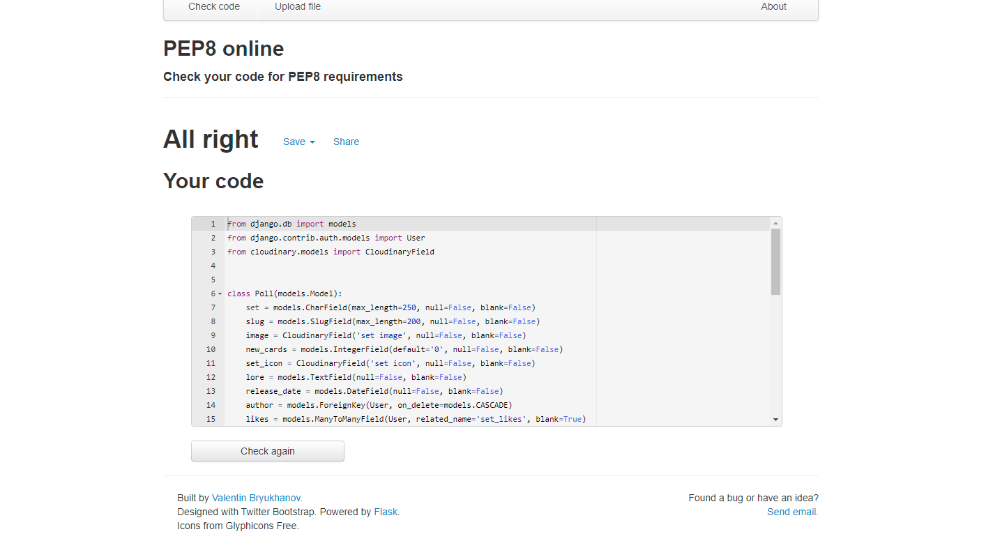
    - settings.py Validation: No errors were returned when passing through the official validator 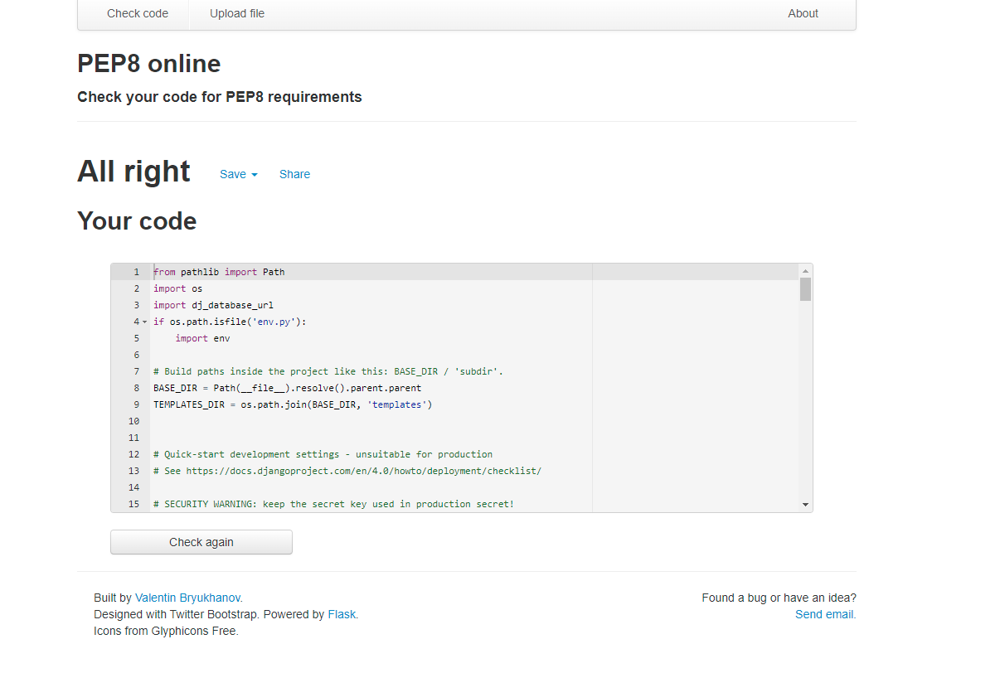
    - urls.py Validation: No errors were returned when passing through the official validator 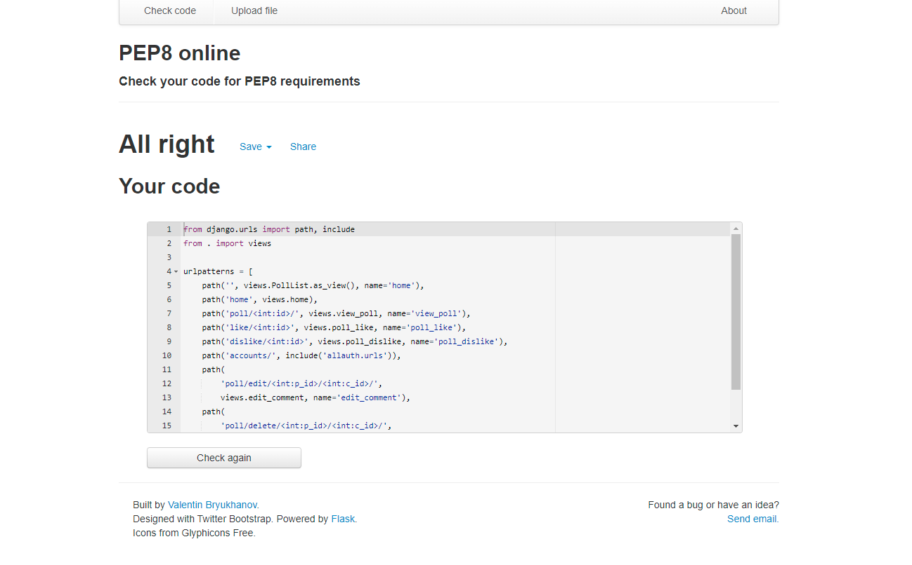
    - views.py Validation: No errors were returned when passing through the official validator 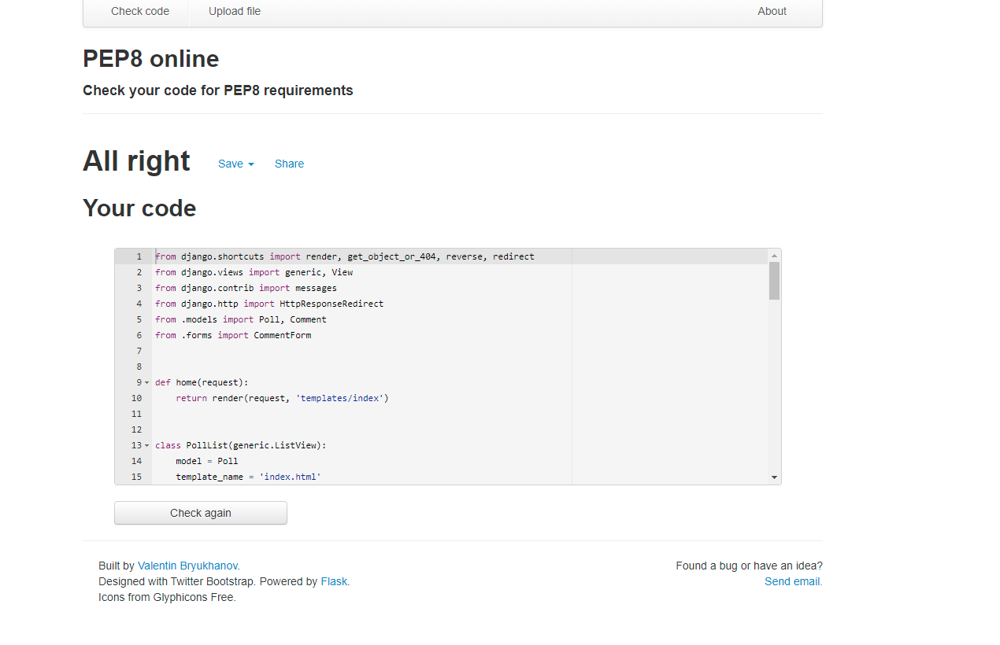

- CSS 
    - No errors were found when passing through the official 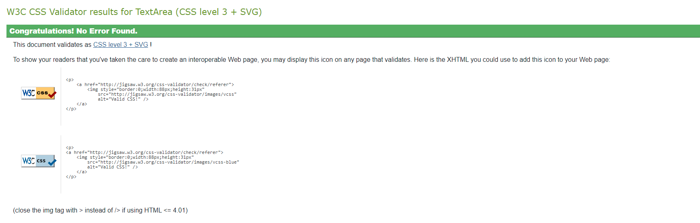

### Browser Capability

### Responsiveness

### Tested User Stories

- As a site user I can view the current opinions of other users on the latest Magic set posts so that I can select and view one. 
    - 
- As a user I can register an account so that I can comment and like/dislike set posts.
    - 
- As a user I can like or dislike a set post so that I can contribute to the opinion of the fan base on the site.
    - 
- As a user I can register a unique account so I can comment and like on each set.
    - 
- As a user I can leave comments on a post so that I can be involved in the conversation.
    -

### Unfixed Bugs

### Deployment

- First step was to sign up to the Heroku online application using an email. Then authenticate and create your account on Heroku.

- 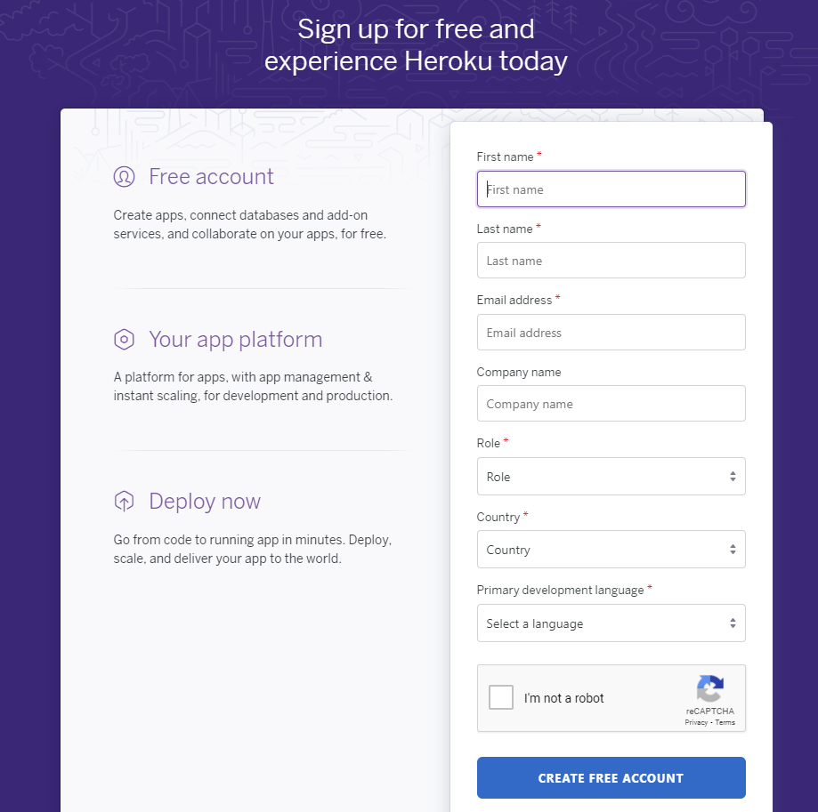

- Then I went to my Heroku account dashboard and clicked new, then create new app.

- 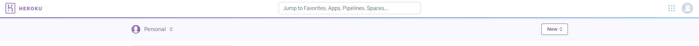

- 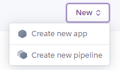

- Next I gave my application a unique name polling-magic-community. Then I selected Europe for region.

- 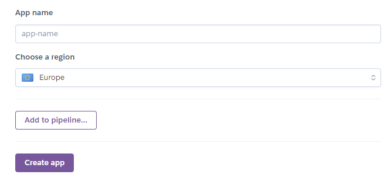

- I installed the add on Postgres to be used as the cloud based database for this project.

- 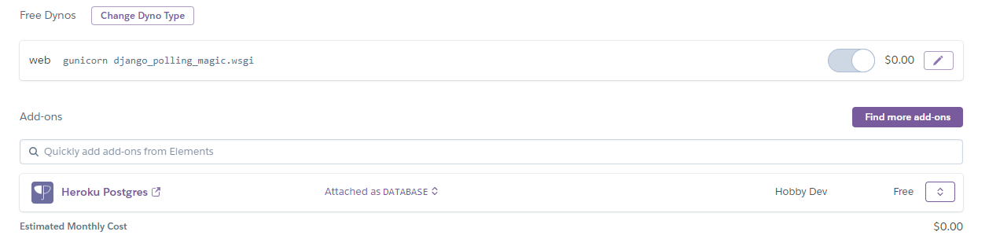

- After the app is created I selected the settings tab. In here I clicked on the Reveal Config Vars button. I first obtained the API key from Cloudinary (the image hosting site used in this project) site. Then input it into the config vars.

- 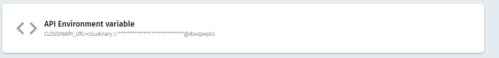

- A env.py was created were the keys for `DATABASE_URL`, `SECRET_KEY` and `CLOUDINARY_URL` would be held.

- I then added a secret key into the env.py file as well as the url from the linked postgres database. 

- 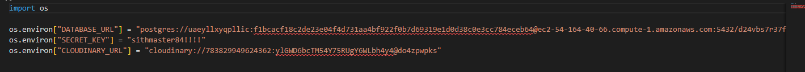

- 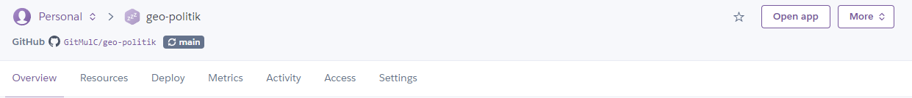

- 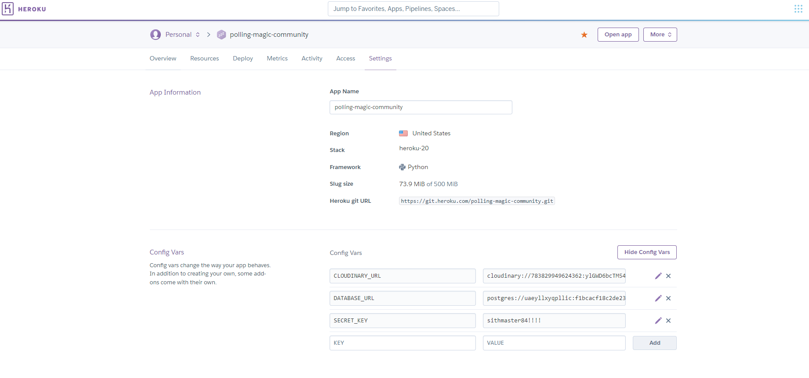

- I then clicked on the Deploy tab. Here I selected GitHub as the deployment method. I then connected to my polling-magic repository on GitHub by typing it in and selecting it.

- Finally ensured that automatic deploys were from the main branch. I clicked on enable automatic deploys and built the app.

- 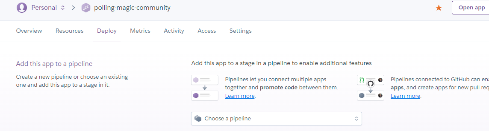

- A Procfile was created into my local workspace in Gitpod. The Procfile is used for declaring what commands are run by your application’s dynos on the Heroku platform.

- After all relevant apps were installed, the requirements.txt file was created using the command `pip3 install -r requirements.txt`. Additionally all apps were listed/frozen onto this txt file using the command `pip3 freeze --local > requirements.txt`.

### Local Deployment

- All changes to the models.py file wer efollowed by the command `python3 manage.py makemigrations` & `python3 manage.py migrate`to commit and push the changes to my local workspace.
- A super user was created using the command `python3 manage.py create superuser`. This was used to sign into the sites admin page.

## Credits

### Content

- The icons in the footer were taken from [Font Awesome](https://fontawesome.com/)
- Coolors.co was used to generate a color palette for the site. [Coolors](https://coolors.co/)
- Responsive images were generated on the site Am I Responsive?. [Am I Responsive?](http://ami.responsivedesign.is/)
- Screenshots and images edited using graphic editor Microsoft Paint. [Mircosoft Paint](https://support.microsoft.com/en-us/windows/open-microsoft-paint-ead1dc5c-abc4-fd2c-d81e-ebb013fbc113)

### Media

- Image of Innistrad: Midnight Hunt set icon taken from mtg.cardsrealm.com [MTG Cards Realm](https://mtg.cardsrealm.com/en-us/sets/smid-innistrad--midnight-hunt-substitute-cards)
- Image of Innistrad: Midnight Hunt set taken from mtg wiki [MTG Wiki](https://mtg.fandom.com/wiki/Innistrad:_Midnight_Hunt)
- Image of Adventures in the Forgotten Realms set icon taken from mtg.cardsrealm.com [MTG Cards Realm](https://mtg.cardsrealm.com/en-us/sets/tafr-adventures-in-the-forgotten-realms-tokens)
- Image of Adventures in the Forgotten Realms set taken from Reddit [Reddit](https://www.reddit.com/r/magicTCG/comments/nul0ek/what_are_your_predictions_and_expectations_for/)

### Acknowledgments

- I want to thank Code Institute and in particular my mentor Tim for his assitance throughout this projects' development.